## Threads Clone

A modern social media application inspired by Threads, designed for seamless content sharing and interaction. Built with Next.js, TypeScript, and Firebase for a scalable, full-stack experience.

**Features**

- User Authentication: Secure and seamless authentication powered by Clerk.

- Dynamic Post Feeds: Real-time updates for posts, ensuring users always see the latest content.

- Responsive Design: Fully optimized for mobile and desktop devices using TailwindCSS.

- Like and Comment System: Engage with posts through likes and comments, updated dynamically.

- User Profiles: Customizable user profiles, allowing users to edit their profile pictures, bios, and more.

- Serverless API Integration: Efficient API endpoints for managing posts, comments, and user interactions.

- Scalable Backend: Built with MongoDB for efficient data storage and retrieval.

- Strong Data Validation: Leveraging React Hook Form and Zod for robust input handling and validation.

**Tech Stack**

- User Authentication: Secure and seamless authentication powered by Clerk.

- Dynamic Post Feeds: Real-time updates for posts, ensuring users always see the latest content.

- Responsive Design: Fully optimized for mobile and desktop devices using TailwindCSS.

- Like and Comment System: Engage with posts through likes and comments, updated dynamically.

- User Profiles: Customizable user profiles, allowing users to edit their profile pictures, bios, and more.

- Serverless API Integration: Efficient API endpoints for managing posts, comments, and user interactions.

- Scalable Backend: Built with MongoDB for efficient data storage and retrieval.

- Strong Data Validation: Leveraging React Hook Form and Zod for robust input handling and validation.

**Getting Started**

Prerequisites:
- Node.js: Ensure you have Node.js installed. Download Node.js

- MongoDB Atlas: Set up a free MongoDB Atlas cluster or run a local instance.

- Clerk API Keys: Obtain your Clerk API keys from the Clerk dashboard.

**Installation**

- Clone the repository:
git clone https://github.com/steven-serruya/threads
cd threads

- Install dependencies:
npm install

- Set up environment variables by creating a .env.local file:
NEXT_PUBLIC_CLERK_FRONTEND_API=your_clerk_frontend_api
CLERK_API_KEY=your_clerk_api_key
MONGODB_URI=your_mongodb_connection_string

- Start the development server:
npm run dev

- Open http://localhost:3000 in your browser to view the app.

**Screenshots**
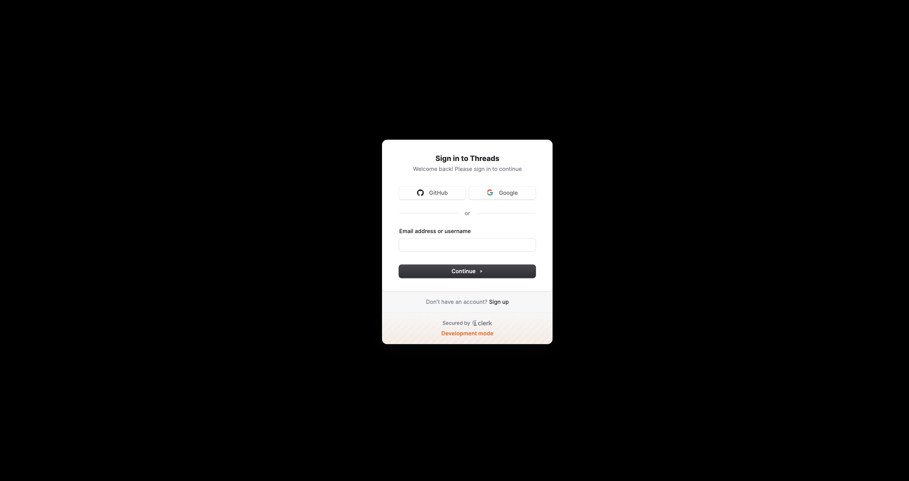
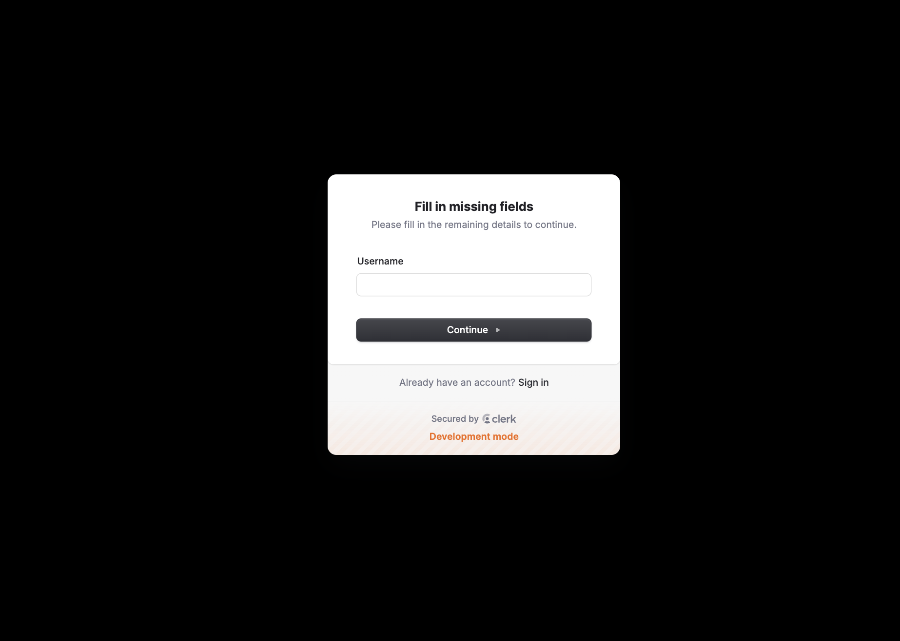
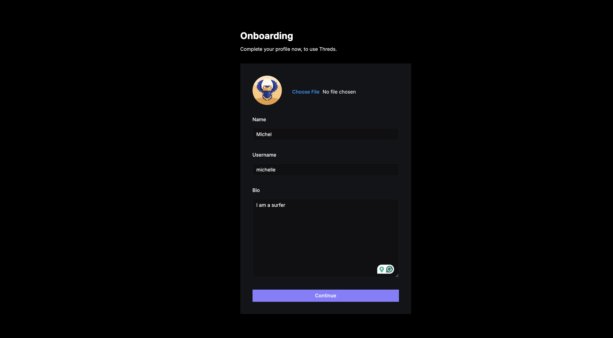
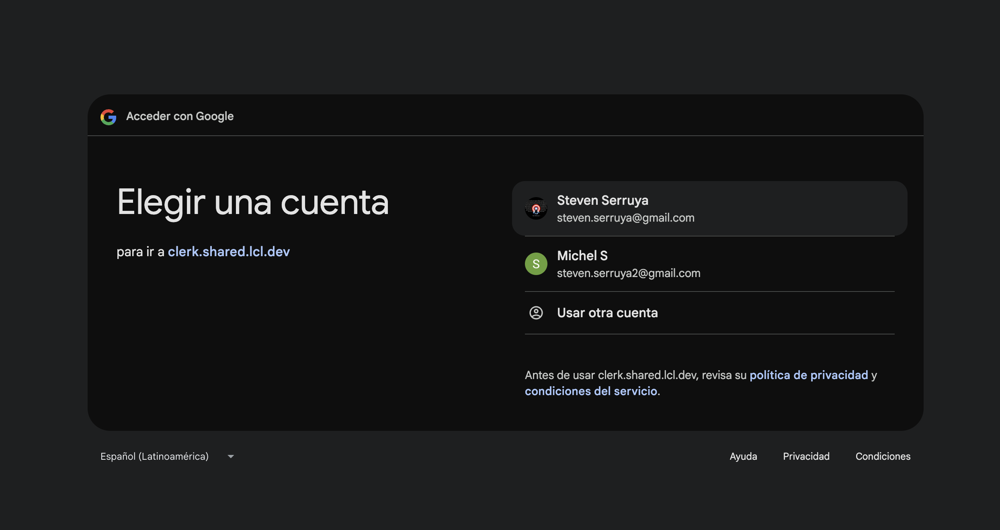
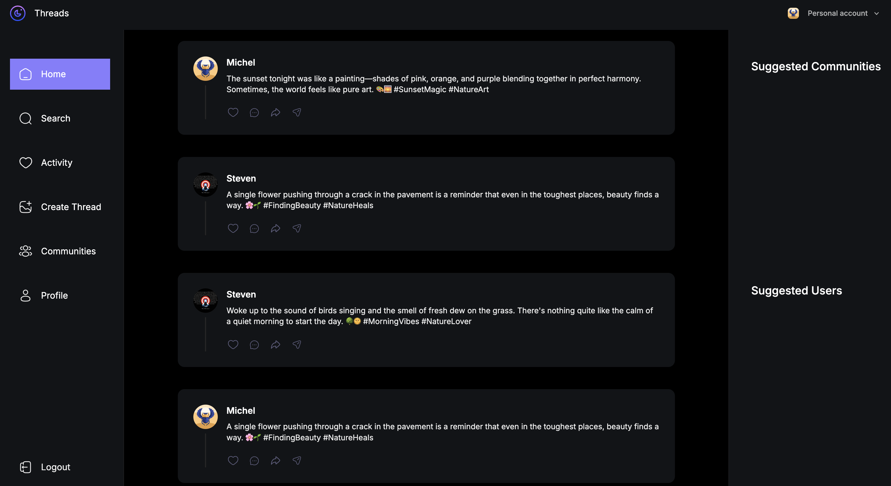
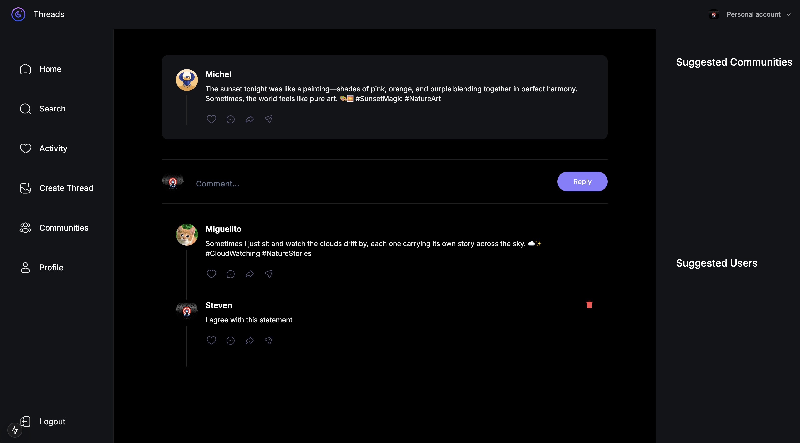
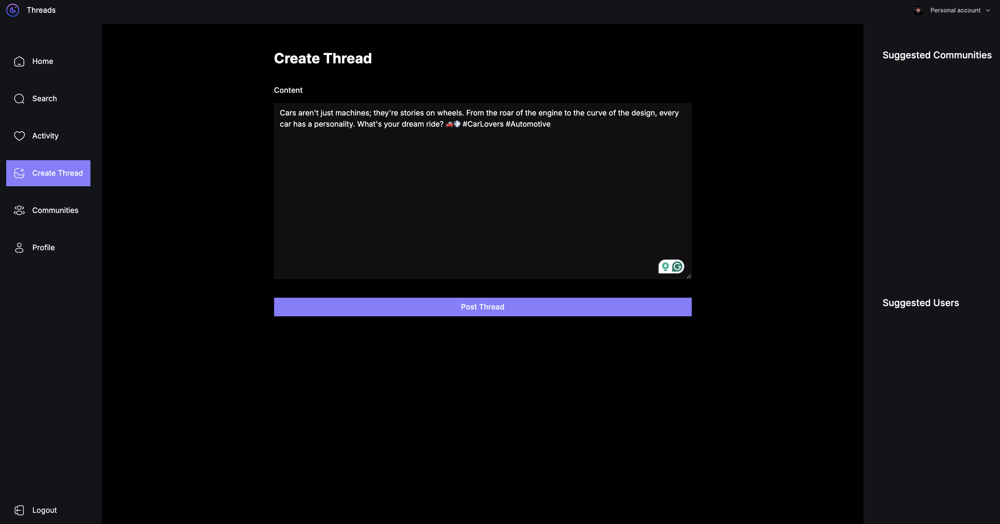
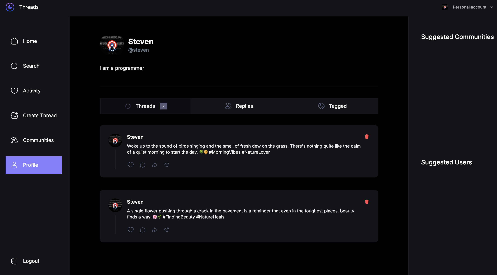
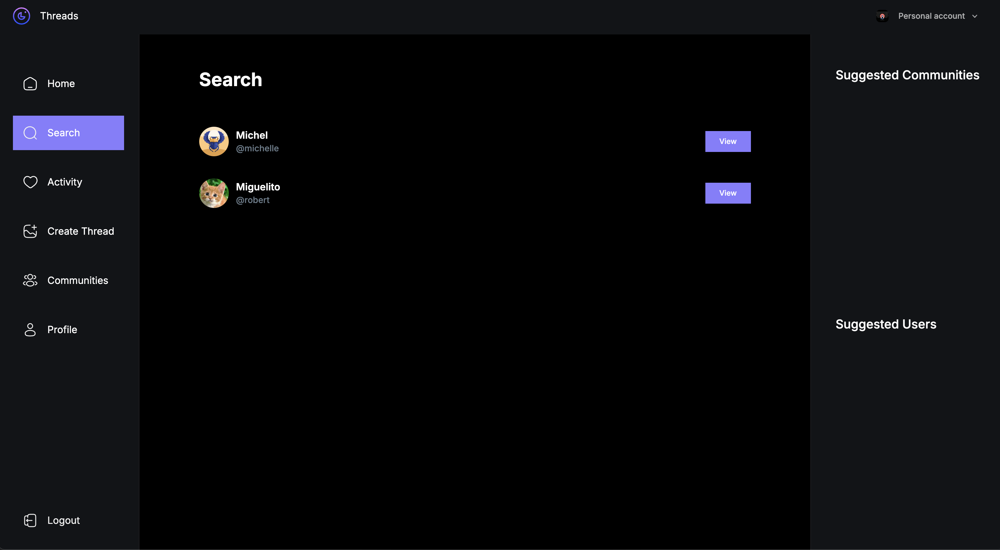
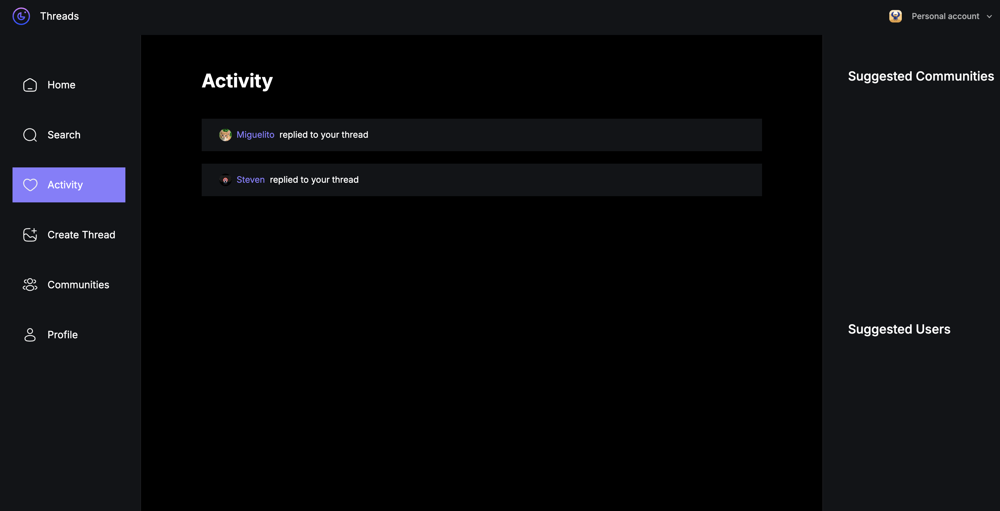
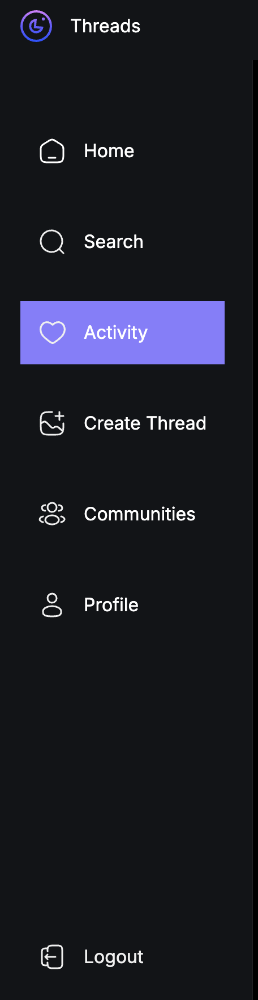

**Acknowledgments**
This project was built under the guidance of JS Mastery, leveraging modern technologies and best practices for full-stack web development.

